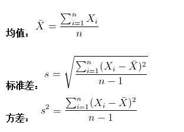
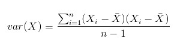
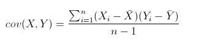
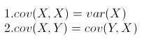
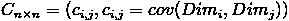
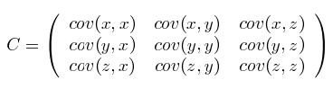

#### 均值，方差和标准差

学过概率统计的孩子都知道，统计里最基本的概念就是样本的均值，方差，或者再加个标准差。首先我们给你一个含有n个样本的集合，依次给出这些概念的公式描述，这些高中学过数学的孩子都应该知道吧，一带而过。

很显然，均值描述的是样本集合的中间点，它告诉我们的信息是很有限的，而标准差给我们描述的则是样本集合的各个样本点到均值的距离之平均。以这两个集合为例，[0，8，12，20]和[8，9，11，12]，两个集合的均值都是10，但显然两个集合差别是很大的，计算两者的标准差，前者是8.3，后者是1.8，显然后者较为集中，故其标准差小一些，标准差描述的就是这种“散布度”。之所以除以n-1而不是除以n，是因为这样能使我们以较小的样本集更好的逼近总体的标准差，即统计上所谓的“无偏估计”。而方差则仅仅是标准差的平方。

##### 为什么需要协方差？

上面几个统计量看似已经描述的差不多了，但我们应该注意到，标准差和方差一般是用来描述一维数据的，但现实生活我们常常遇到含有多维数据的数据集，最简单的大家上学时免不了要统计多个学科的考试成绩。面对这样的数据集，我们当然可以按照每一维独立的计算其方差，但是通常我们还想了解更多，比如，一个男孩子的猥琐程度跟他受女孩子欢迎程度是否存在一些联系啊，嘿嘿~协方差就是这样一种用来度量两个随机变量关系的统计量，我们可以仿照方差的定义：

来度量各个维度偏离其均值的程度，标准差可以这么来定义：

协方差的结果有什么意义呢？如果结果为正值，则说明两者是正相关的(从协方差可以引出“相关系数”的定义)，也就是说一个人越猥琐就越受女孩子欢迎，嘿嘿，那必须的~结果为负值就说明负相关的，越猥琐女孩子越讨厌，可能吗？如果为0，也是就是统计上说的“相互独立”。

从协方差的定义上我们也可以看出一些显而易见的性质，如：

协方差多了就是协方差矩阵

上一节提到的猥琐和受欢迎的问题是典型二维问题，而协方差也只能处理二维问题，那维数多了自然就需要计算多个协方差，比如n维的数据集就需要计算 n! / ((n-2)!*2) 个协方差，那自然而然的我们会想到使用矩阵来组织这些数据。给出协方差矩阵的定义：

这个定义还是很容易理解的，我们可以举一个简单的三维的例子，假设数据集有三个维度，则协方差矩阵为

可见，协方差矩阵是一个对称的矩阵，而且对角线是各个维度上的方差。

---
原文： [点击跳转](https://blog.csdn.net/xiao_lxl/article/details/72730000)

